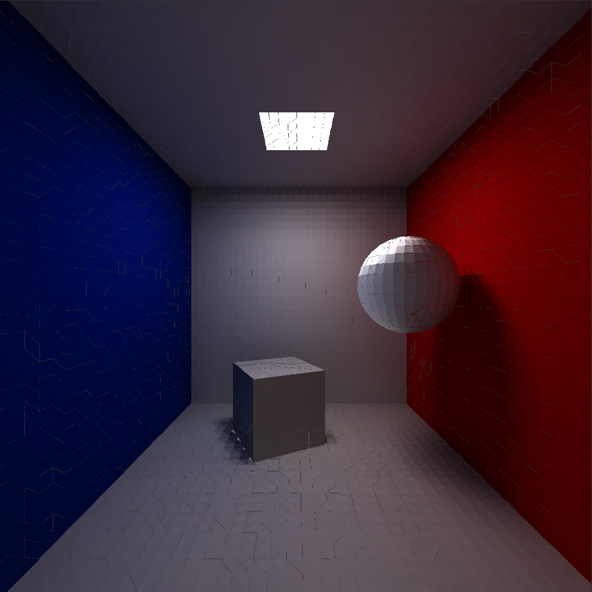

% Anisotropic Viscosity and Astrophysical Applications
% Jamie Quinn
% Supervisor: David MacTaggart

\newcommand{\ten}[1]{\mathbf{#1}}

## MHD

--- 

- Momentum Equation ($\frac{D\vec{u}}{Dt} = \cdots$)
- Energy Equation ($\frac{DE}{Dt} = \cdots$)
- Induction Equation ($\frac{D\vec{B}}{Dt} = \cdots$)

## Viscosity

--- 

- Measure of internal friction (molecular interactions)
- Produces internal heating
- Produces momentum transportation and dissipation

---

Layers of fluid dragged by friction and momentum transported upwards

## Viscosity Stress Tensor

--- 

In Newtonian fluids, viscous stress directly proportional to rate of strain.

$\ten{\sigma_{iso}} = \nu\ten{W}$

$\ten{W} = \frac{1}{2}\left(\nabla\vec{u} + (\nabla\vec{u})^T \right) - \frac{1}{3}(\nabla \cdot \vec{u})\ten{I}$

. . .

However magnetic field changes nature of small scale frictional interactions

. . .

Momentum transported better along magnetic field lines than perpendicularly

## Anisotropic viscosity

---

Viscous stress now depends on $\vec{u}$ **and** $\vec{B}$.

## Anisotropic Viscous Stress Tensor

---

Model Requirements:

- Correctly include anisotropic nature of viscosity
- Smoothly reduce to isotropic form in absence of magnetic field

. . .

Two models implemented:

- Braginskii Viscosity - physically based
- Parallel-Isotropic Switch - avoids numerical issues

## Braginskii Viscosity

---

Kinetic theory $\to$ two fluid model $\to$ one fluid model

. . .

$$
\ten{\sigma_{brag}} = \eta_0 \ten{W}^{(0)} + \eta_1 \ten{W}^{(1)} + \eta_2 \ten{W}^{(2)} + \eta_3 \ten{W}^{(3)} + \eta_4 \ten{W}^{(4)},
$$

. . .

with parallel term,
$$
\ten{W}^{(0)} = \frac{3}{2}(\ten{\ten{W}}\vec{b}\cdot\vec{b}) \left( \vec{b} \otimes \vec{b} - \frac{1}{3}\ten{I} \right),
$$

. . .

perpendicular terms,
$$
\begin{align}
\ten{W}^{(1)} &= (\ten{I} - \vec{b} \otimes \vec{b})\ten{\ten{W}}(\ten{I} - \vec{b} \otimes \vec{b}) + \frac{1}{2}(\ten{\ten{W}}\vec{b} \cdot \vec{b})(\ten{I} - \vec{b} \otimes \vec{b}), \\
\ten{W}^{(2)} &= (\ten{I} - \vec{b} \otimes \vec{b})\ten{\ten{W}}(\vec{b} \otimes \vec{b}) + (\vec{b} \otimes \vec{b})\ten{\ten{W}}(\ten{I} - \vec{b} \otimes \vec{b}),  \\
\end{align}
$$

. . .

and drift terms,
$$
\begin{align}
\ten{W}^{(3)} &= \frac{1}{2} \ten{Z}\ten{\ten{W}}(\ten{I} - \vec{b} \otimes \vec{b}) - \frac{1}{2}(\ten{I} - \vec{b} \otimes \vec{b})\ten{\ten{W}}\ten{Z}, \\
\ten{W}^{(4)} &= (\ten{Z}\ten{\ten{W}}\vec{b}) \otimes \vec{b} + \vec{b} \otimes (\ten{Z} \ten{\ten{W}} \vec{b}). \\
\end{align}
$$

--- 

$\eta_j$ are the ion transport coefficients, dependent on

- isotropic viscosity parameter $\eta_0$, equivalent to earlier $\nu$
- the parameter $x = \omega \tau$, a combination of $\omega$, the ion cyclotron frequency, and $\tau$, the ion-ion collision time

. . .

In absence of magnetic field, this correctly reduces to isotropic viscosity.

As $B \to 0$, $\ten{\sigma_{brag}} \to \eta_0\ten{W} = \sigma_{iso}$

. . .

### Problem:

In topologically complex corona, low resolution of null points causes anisotropy to bleed into isotropic areas

## Parallel-Isotropic Switch

---

Interpolate between strong field approximation of Braginskii tensor,

. . .

$$
\sigma_{parallel} = \eta_0 \ten{W}^{(0)} = \frac{3}{2}(\ten{\ten{W}}\vec{b}\cdot\vec{b}) \left( \vec{b} \otimes \vec{b} - \frac{1}{3}\ten{I} \right),
$$

. . .

and no field viscosity tensor (isotropic),

. . .

$$
\sigma_{iso} = \eta_0 \ten{W},
$$

. . .

using interpolation function dependent on $\vec{B}$ through constitutive function $a(|\vec{B}|)$.

. . .

$$
s(|\vec{B}|) = \frac{3 \exp[2a]}{2\sqrt{2\pi a} \text{erfi}[\sqrt{2a}]} - \frac{1}{2}\left[ 1 + \frac{3}{4a} \right].
$$

---

---

## Work So Far: LARE1D

---

1D Euler equation solver using LAgrangian-REmap scheme

- Lagrangian step solves equations in Lagrangian form, deforming grid
- Remap step maps variables back to Eulerian grid

. . .

---

{#id .class height=500px}

Initial conditions

---

{#id .class height=500px}

After 350 timesteps (analytic solution in green)

---

## Work So Far: Comparison of Viscosity Models - Null Point Study

---

#### Initial Field

{#id .class height=500px}

---

#### Twisted Field

{#id .class height=500px}

---

#### Isotropic Heating

{#id .class height=500px}

---

#### Braginskii Isotropic Heating

{#id .class height=500px}

---

#### Parallel-Iso Isotropic Heating

{#id .class height=500px}

---

#### Braginskii Anisotropic Heating

{#id .class height=500px}

---

#### Parallel-Iso Anisotropic Heating

{#id .class height=500px}

---

Model | Total Heat Generated | Max Iso Heat/Time | Max Ani Heat/Time
---|---|---|---
Iso | $9.37\times 10^{-4}$ | $1.53\times 10^{-4}$ | n/a
Brag | $4.04\times 10^{-6}$ | $6.36\times 10^{-7}$ | $4.95\times 10^{-7}$
Switch | $5.78\times 10^{-6}$ | $31.4\times 10^{-7}$ | $3.59\times 10^{-7}$

## PRACE Summer of HPC

## {data-background-image="./sophc.jpg"}

## {data-background-image="./ICHEC.jpg"}

## {data-background-image="./dublin.jpg"}

---

{#id .class height=600px}

## Next Steps: Flux Emergence

- Apply anisotropic viscosity
- Use interpolation function as way of tracking magnetic null points

## Thanks for listening!
